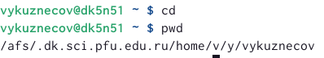
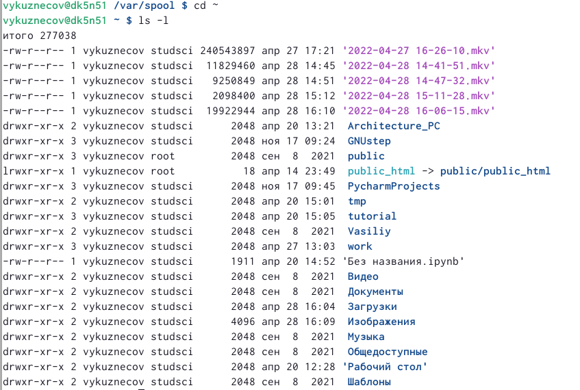
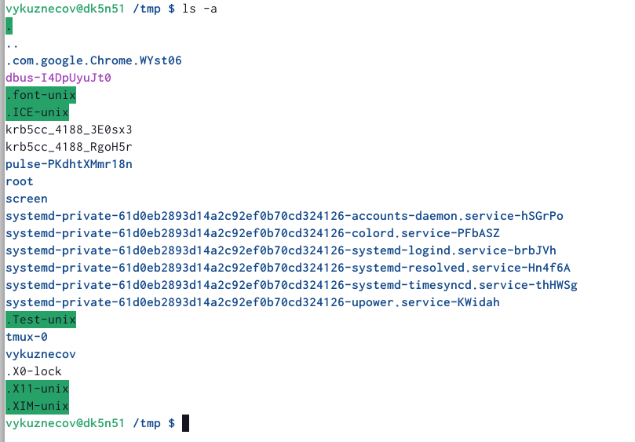
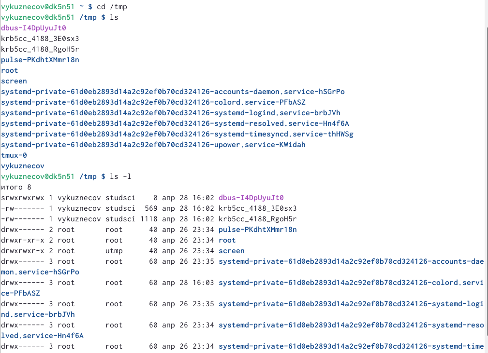
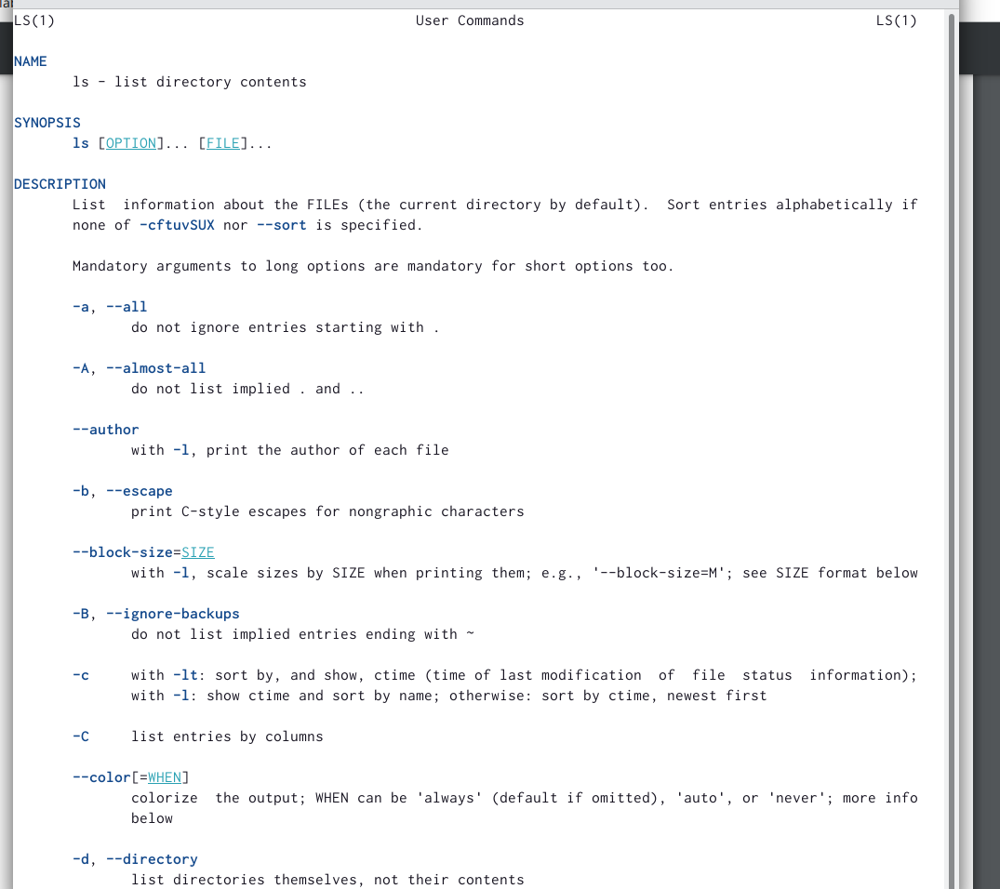
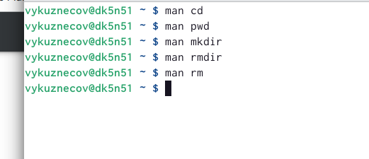
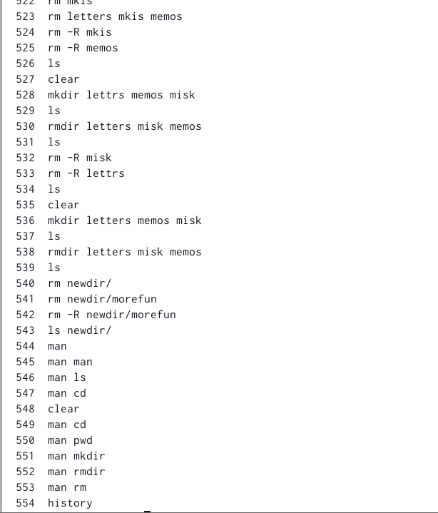
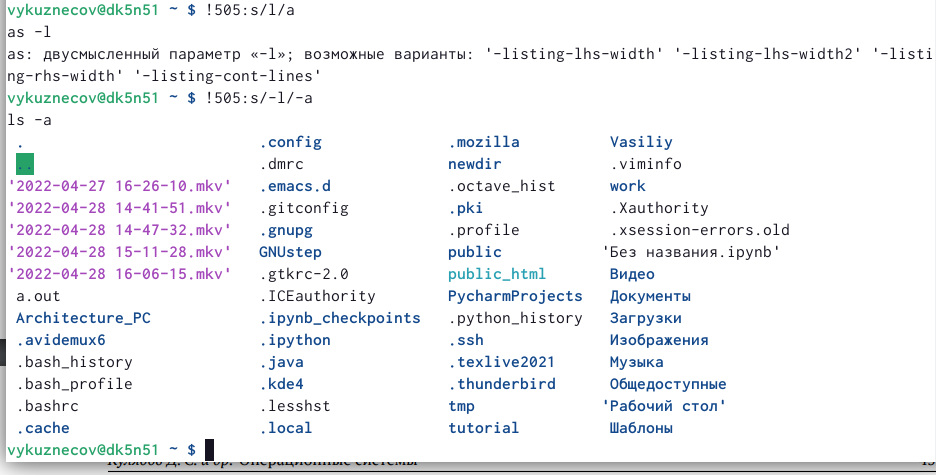

---
## Front matter
lang: ru-RU
title: Лабораторная работа №4
author: |
    Кузнецов Василий - студент группы НФИбд-01-21
date: 20.04.2022

## Formatting
toc: false
slide_level: 2
theme: metropolis
header-includes: 
 - \metroset{progressbar=frametitle,sectionpage=progressbar,numbering=fraction}
 - '\makeatletter'
 - '\beamer@ignorenonframefalse'
 - '\makeatother'
aspectratio: 43
section-titles: true
---

# Основы интерфейса взаимодействия пользователя с системой Unix на уровне командной строки

## Цель работы

- Приобретение практических навыков взаимодействия пользователя с системой посредством командной строки.

## Выполнение лабораторной работы

1. Определение полного пути домашнего каталога 
## 

Перход в каталог <i>tmp</i>. Команда ls - просмотр содержимого каталога, команда ls -l - расширенный просмотр каталога 

## 

Команда ls -a - просмотр содержимого каталога вместе со скрытыми файлами 

## 

Опция ls позволяющая отсортировать файлы по времени последнего изменения.

## 

Команда man для просмотра описания команд: cd, pwd, mkdir, rmdir, rm.

## 

Используя команду history посмотрим на последние команды и вызовем команду 505 

##

Вызов команды 505 и модификация команды 505: замена -l на -a 

## Вывод

Освоили основные команды командной строки. Попрактиковались в создании директрорий и их удалению. Освоили команду man для вызова манула по команде. Освоили другие основные команды.
