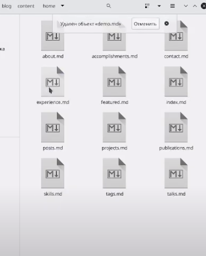

---
## Front matter
title: "Индивидуальный проект 1 этап"
subtitle: "Операционные системы"
author: "Кузнецов Василий Юрьевич"

## Generic otions
lang: ru-RU
toc-title: "Содержание"

## Bibliography
bibliography: bib/cite.bib
csl: pandoc/csl/gost-r-7-0-5-2008-numeric.csl

## Pdf output format
toc: true # Table of contents
toc-depth: 2
lof: true # List of figures
lot: true # List of tables
fontsize: 12pt
linestretch: 1.5
papersize: a4
documentclass: scrreprt
## I18n polyglossia
polyglossia-lang:
  name: russian
  options:
	- spelling=modern
	- babelshorthands=true
polyglossia-otherlangs:
  name: english
## I18n babel
babel-lang: russian
babel-otherlangs: english
## Fonts
mainfont: PT Serif
romanfont: PT Serif
sansfont: PT Sans
monofont: PT Mono
mainfontoptions: Ligatures=TeX
romanfontoptions: Ligatures=TeX
sansfontoptions: Ligatures=TeX,Scale=MatchLowercase
monofontoptions: Scale=MatchLowercase,Scale=0.9
## Biblatex
biblatex: true
biblio-style: "gost-numeric"
biblatexoptions:
  - parentracker=true
  - backend=biber
  - hyperref=auto
  - language=auto
  - autolang=other*
  - citestyle=gost-numeric
## Pandoc-crossref LaTeX customization
figureTitle: "Рис."
tableTitle: "Таблица"
listingTitle: "Листинг"
lofTitle: "Список иллюстраций"
lotTitle: "Список таблиц"
lolTitle: "Листинги"
## Misc options
indent: true
header-includes:
  - \usepackage{indentfirst}
  - \usepackage{float} # keep figures where there are in the text
  - \floatplacement{figure}{H} # keep figures where there are in the text
---

# Цель работы

Размещение на Github pages заготовки для персонального сайта.

Установить необходимое программное обеспечение.
Скачать шаблон темы сайта.
Разместить его на хостинге git.
Установить параметр для URLs сайта.
Разместить заготовку сайта на Github pages.

# Задание

Научиться создавать сайт и переносить его на сервер гитхаба

# Выполнение индивидуального проекта

Скачиваем исполняемы файл Hugo для того, чтобы генерировать страницы сайта. и скачиваем его выбираем нужный нам файл. Выбираем файл hugo, создаём в домашнем каталоге папку bin и копируем в неё файл hugo (рис. [-@fig:001])

{ #fig:001 width=70% }

Далее создаём репозиторий, используя шаблон. Указываем имя блога (рис. [-@fig:002])

{ #fig:002 width=70% }

Репозиторий создался. Теперь мы можем его клонировать. копируем ссылку вставляем сылку в терминал с командой гит клон. Создался каталог блога(рис. [-@fig:003])

{ #fig:003 width=70% }

Теперь переходим в блог и выполняем команду ~/bin/hugo видим, чтобы появился каталог public. (рис. [-@fig:004])

{ #fig:004 width=70% }

Далее выполняем команду ~/bin/hugo server. Благодаря этой команде мы получили ссылку. Переходим по ней. Получаем сайт, который создался благодаря этой команде. Но нужно удалить один из файлов, чтобы исчез зелёный фон. (рис. [-@fig:005])

{ #fig:005 width=70% }
 
Чтобы удалить файл нужно перейти в каталог content/home/ и удалить файл demo.md рис 12
зелёный фон пропал (рис. [-@fig:006])

{ #fig:006 width=70% }

Нужно создать ещё один репозиторий, чтобы доступ к сайту осуществлялся с любого компьютера переходим на гит хаб и создаём новый репозиторий с определённым названием. рис 13 (рис. [-@fig:007])

{ #fig:007 width=70% }

В терминале клонируем созданный второй репозиторий. Создаём пустой файл README.md рис 14 (рис. [-@fig:008])

{ #fig:008 width=70% }

Теперь мы выполняем команду, которая подключит наш репозиторий к папке public нашего блога (рис. [-@fig:009])

{ #fig:009 width=70% }

Далее заходим в gitignore и комментируем public
Нужно убедиться, что не будет игнорироваться каталог public (рис. [-@fig:010])

{ #fig:010 width=70% }

# Выводы

Научился делать сайт.

